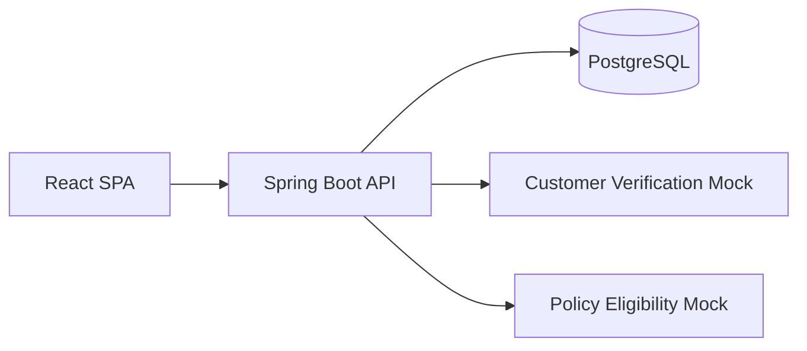

# AgentFlow

AgentFlow is a portfolio workflow application for creating insurance-policy applications from versioned JSON definitions and submitting them through REST and legacy SOAP integrations. It demonstrates the engineering around a business workflow—validation, state transitions, retries, transaction boundaries, failure handling, and traceable integration activity—without hiding those concerns behind unnecessary distributed infrastructure.

The MVP includes Auto and Home policy workflows, a React portal, a Spring Boot API, PostgreSQL persistence, two runnable downstream mocks, a Python customer importer, and a Postman demonstration suite.

## Architecture



`docker-compose.yml` runs PostgreSQL and both mocks. The API and frontend run locally for the primary development path.

| Component | Technology | Port |
|---|---|---:|
| Portal | React 19, Vite 8, React Router | 5173 |
| API | Java 21, Spring Boot 3.4, Spring MVC, JPA, Flyway | 8080 |
| Database | PostgreSQL 16 | 5432 |
| Customer verification mock | Node.js HTTP service | 8091 |
| Policy eligibility mock | Spring Web Services | 8092 |

## Design highlights

### JSON-driven workflows

Auto and Home definitions live in `backend/src/main/resources/workflows/`. Startup validates and seeds these versioned files into PostgreSQL. Creating an application pins its `workflow_definition_id`, so a draft continues to use the exact version with which it began. The API returns that pinned definition and the portal's shared `DynamicForm` renders supported text, number, date, select, checkbox, validation, and `visibleWhen` behavior. There are no product-specific form components.

Flyway owns the schema; Hibernate runs with `ddl-auto: validate`.

### Submission and integrations

A submission claims a `DRAFT` application in a short database transaction, then performs downstream work outside that transaction:

1. Customer verification through Spring `WebClient` and JSON REST.
2. Policy eligibility through Spring-WS, JAXB mapping, and SOAP/XML.
3. A final status of `APPROVED`, `MANUAL_REVIEW`, `INELIGIBLE`, or `INTEGRATION_FAILURE`.

Retryable integration failures use up to three attempts with a short backoff. Every attempt is committed independently as a `SUCCESS` or `FAILED` Integration Activity, so evidence survives a failed submission. Submitting an already-claimed application returns `409 Conflict`, protecting downstream systems from double-clicks and accidental resubmission.

The SOAP artifacts are intentionally visible:

- Runtime WSDL: `http://localhost:8092/ws/policyEligibility.wsdl`
- Checked-in WSDL: `mocks/policy-eligibility/src/main/resources/wsdl/policy-eligibility.wsdl`
- Source XSD: `mocks/policy-eligibility/src/main/resources/xsd/policy-eligibility.xsd`
- API client: `backend/src/main/java/com/agentflow/integration/soap/PolicyEligibilitySoapClient.java`

### Errors and observability

API validation, missing resources, duplicate email, invalid state transitions, and double-submit errors use Spring `ProblemDetail`. Each request accepts or generates `X-Correlation-Id`; submission stores it on the application, propagates it to REST and SOAP, returns it as a response header, and records it with integration attempts.

Use `GET /api/applications/{id}/activities` to inspect integration name and type, action, status, HTTP status where applicable, duration, attempt number, safe request/response summaries, and error details.

Failure injection is isolated from business records. It is available only under the `local` or `demo` Spring profile through the `X-Demo-Scenario` submit header:

- `rest-500`
- `rest-timeout`
- `soap-fault`
- `soap-manual-review`

The mocks also expose independent `POST /admin/faults` controls. REST modes are `none`, `http500`, `http503`, and `timeout`; SOAP modes are `none`, `fault`, and `manual_review`.

## Run locally

Prerequisites: Docker with Compose, Java 21, Node.js compatible with Vite 8, and Python 3.

Start PostgreSQL and the two downstream mocks:

```bash
docker compose up --build -d
```

Start the API with demo scenarios enabled:

```bash
cd backend
./mvnw spring-boot:run -Dspring-boot.run.profiles=local
```

In another shell, start the portal:

```bash
cd frontend
npm ci
npm run dev
```

Open `http://localhost:5173`. Vite proxies `/api` to `http://localhost:8080`. The default API profile still calls the real local mocks; use `local` or `demo` when the portal and Postman demo-scenario header should be enabled.

Stop dependencies with:

```bash
docker compose down
```

## Tests

Backend integration tests use Testcontainers, so Docker must be running:

```bash
cd backend
./mvnw verify
```

Unit tests run through Surefire and `*IT` integration tests run through Failsafe during `verify`.

Frontend:

```bash
cd frontend
npm ci
npm test
npm run lint
npm run build
```

SOAP mock:

```bash
cd mocks/policy-eligibility
mvn test
```

Python importer:

```bash
python3 -m venv .venv
source .venv/bin/activate
pip install -r scripts/python/requirements.txt
pytest scripts/python/tests
```

## Postman

Import:

- `postman/AgentFlow.postman_collection.json`
- `postman/local.postman_environment.json`

Select **AgentFlow Local**, then run the Customers, Workflows, and Application lifecycle folders in order. The create requests capture `customerId` and `applicationId`; the lifecycle proves draft save, pinned definition, REST and SOAP activity, approval, and double-submit `409`.

For a profile-gated scenario, create and save a fresh draft before each request in **Demo profile scenarios**. **Mock administration** directly configures persistent mock fault modes; reset each mock to `none` after experimenting.

## Python customer import

The importer reads `first_name,last_name,email,phone`, trims values, normalizes email case, validates each row, and posts valid records to `POST /api/customers`. It continues after row or API errors, reports each error to stderr, and exits with status `1` if any row failed.

```bash
python scripts/python/import_customers.py \
  scripts/python/samples/customers.csv \
  --base-url http://localhost:8080
```

The sample emails are fixed, so a second import deliberately demonstrates the API's duplicate-email `409` handling.

## Repository map

```text
backend/                       Spring Boot REST API and workflow orchestration
frontend/                      React/Vite portal and shared dynamic form
mocks/customer-verification/  REST dependency with admin fault controls
mocks/policy-eligibility/      Spring-WS SOAP dependency, WSDL, and XSD
scripts/python/                CSV customer importer, sample, and tests
postman/                       API collection and local environment
docker-compose.yml             PostgreSQL and both downstream mocks
```

The scope is intentionally a modular monolith with no authentication, Kafka, or distributed idempotency layer. That keeps the portfolio focused on inspectable workflow and integration behavior.
