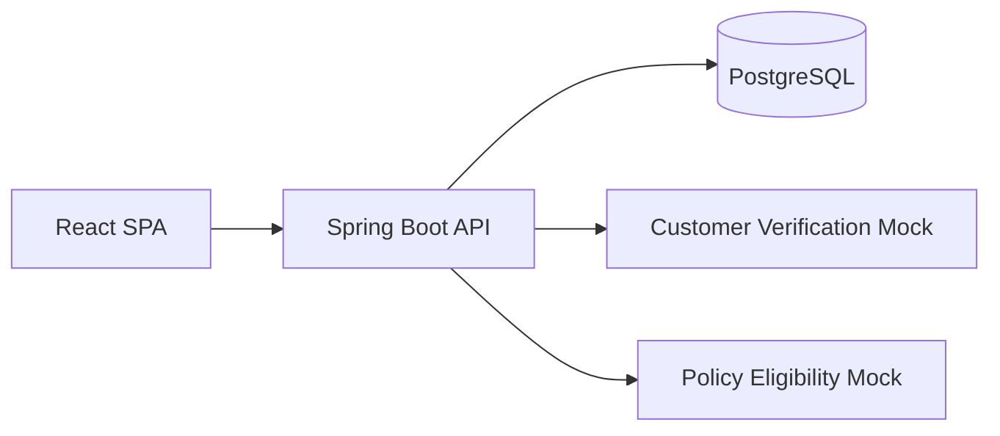

# AgentFlow Implementation Plan

> **For agentic workers:** REQUIRED SUB-SKILL: Use superpowers:subagent-driven-development (recommended) or superpowers:executing-plans to implement this plan task-by-task. Steps use checkbox (`- [ ]`) syntax for tracking.

**Goal:** Build the AgentFlow portfolio MVP — a modular Spring Boot + React insurance agent portal with JSON-defined forms, REST + SOAP integrations, durable integration activity, and demo-only failure injection — in small, verifiable vertical slices.

**Architecture:** Flat monorepo. Spring Boot modular monolith (`customer`, `application`, `workflow`, `integration`, `demo`, `common`) talks to PostgreSQL via Flyway + JPA. Vite/React SPA consumes REST. Tiny Compose mock REST service and a Spring-WS SOAP mock with visible WSDL. Applications pin `workflow_definition_id` at create. Submit uses short DB transactions around state/activity; network calls run outside open transactions.

**Tech Stack:** Java 21, Spring Boot 3.4.x, Maven, Spring Web, Spring Data JPA, Bean Validation, Flyway, PostgreSQL, Spring WebFlux `WebClient` (HTTP client only), Spring Web Services (SOAP client + mock), Vite, React 18 (JavaScript), Docker Compose, Python 3.11+, Postman Collection v2.1, JUnit 5, Testcontainers, React Testing Library, Vitest.

**Spec:** `docs/superpowers/specs/2026-09-10-agentflow-design.md`

## Global Constraints

- No authentication in MVP; landing page is the gate.
- Frontend is JavaScript (not TypeScript).
- Form config is a custom JSON definition (`definition_json`), not formal JSON Schema.
- Applications pin `workflow_definition_id`; never validate drafts against “latest active” after create.
- No `simulate_failure` (or similar) column on `application`; demo tooling only under `local`/`demo` profiles in package `demo`.
- Integration activity status is only `SUCCESS` | `FAILED`; retries are extra rows via `attempt`.
- Only `DRAFT` may `PUT` data or `POST` submit; otherwise `409 Conflict`.
- Never hold a DB transaction open across REST/SOAP calls; activity rows must survive downstream failures.
- Use Flyway for all schema changes; do not use `ddl-auto=update` / Hibernate schema generation for the app schema (`validate` or `none` after Flyway).
- Build Auto end-to-end before adding Home; Home must be definition JSON (+ seed), not product-specific React forms.
- Mock REST service must stay tiny (exercise `WebClient`, not a second product).
- SOAP WSDL/XSD, marshalling, client config, and fault handling must be easy to find in the repo.
- Each task ends with a verifiable test, API call, UI behavior, or observable integration result.
- Do not add Kafka, Redis, K8s, GraphQL, Keycloak, Terraform, or extra microservices.
- Prefer Spring `ProblemDetail` for errors; include `correlationId`.
- Frequent commits; TDD where the task specifies failing tests first.

---

## Milestone map (vertical slices)

| Milestone | Deliverable you can demo | Tasks |
|---|---|---|
| M1 | Create/list customers via API + UI | 1–3 |
| M2 | Render Auto form from pinned definition | 4–6 |
| M3 | Save/validate Auto draft; reject bad data | 7 |
| M4 | Submit Auto → REST verification + activity | 8–9 |
| M5 | SOAP eligibility; full Auto happy path | 10–11 |
| M6 | Activity UI, retries, demo failures | 12–13 |
| M7 | Home as config-only; architecture proof | 14 |
| M8 | Python import, Postman, README | 15 |

**Do not** scaffold the entire backend domain before a runnable customer slice. **Do not** implement Home until Auto submit + both integrations work.

---

## File structure (target)

```text
agentflow/
├── docker-compose.yml
├── README.md
├── backend/
│   ├── pom.xml
│   └── src/
│       ├── main/
│       │   ├── java/com/agentflow/
│       │   │   ├── AgentFlowApplication.java
│       │   │   ├── common/          # CorrelationIdFilter, ProblemDetail advice
│       │   │   ├── customer/
│       │   │   ├── workflow/
│       │   │   ├── application/
│       │   │   ├── integration/     # activity, WebClient, SOAP client, retry
│       │   │   └── demo/            # @Profile({"local","demo"}) only
│       │   └── resources/
│       │       ├── application.yml
│       │       ├── application-local.yml
│       │       ├── db/migration/    # Flyway
│       │       └── workflows/       # auto-policy-v1.json, later home-policy-v1.json
│       └── test/java/com/agentflow/...
├── frontend/
│   ├── package.json
│   ├── vite.config.js
│   └── src/
│       ├── main.jsx
│       ├── App.jsx
│       ├── api/client.js
│       ├── pages/LandingPage.jsx
│       ├── pages/CustomersPage.jsx
│       ├── pages/NewApplicationPage.jsx
│       ├── pages/ApplicationDetailPage.jsx
│       └── components/DynamicForm.jsx   # shared renderer — NEVER AutoPolicyForm.jsx
├── mocks/
│   ├── customer-verification/         # tiny HTTP server (preferred: single-file Spring or Node)
│   │   ├── Dockerfile
│   │   └── ...                        # /verify + /admin/faults only
│   └── policy-eligibility/            # Spring-WS; WSDL/XSD first-class
│       ├── src/main/resources/wsdl/ or xsd/
│       └── ...
├── scripts/python/
│   ├── requirements.txt
│   ├── import_customers.py
│   └── tests/
├── postman/
│   ├── AgentFlow.postman_collection.json
│   └── local.postman_environment.json
└── docs/superpowers/...
```

---

### Task 1: Compose Postgres + Spring Boot + Flyway baseline + health

**Files:**
- Create: `docker-compose.yml`
- Create: `backend/pom.xml`
- Create: `backend/src/main/java/com/agentflow/AgentFlowApplication.java`
- Create: `backend/src/main/resources/application.yml`
- Create: `backend/src/main/resources/db/migration/V1__baseline.sql` (empty comment or `SELECT 1` noop — prefer a real comment-only migration Flyway accepts, or create `flyway_schema_history` via first real table in Task 2; use `V1__baseline.sql` with `-- AgentFlow baseline`)
- Create: `backend/src/test/java/com/agentflow/HealthIT.java`
- Create: `.gitignore` (root: `node_modules/`, `target/`, `.env`, IDE junk)

**Interfaces:**
- Produces: runnable API on `http://localhost:8080` with `GET /api/health` → 200; Postgres on `5432`; Flyway enabled; `spring.jpa.hibernate.ddl-auto=validate`

- [ ] **Step 1: Write `docker-compose.yml` (Postgres only for now)**

```yaml
services:
  postgres:
    image: postgres:16-alpine
    environment:
      POSTGRES_DB: agentflow
      POSTGRES_USER: agentflow
      POSTGRES_PASSWORD: agentflow
    ports:
      - "5432:5432"
    healthcheck:
      test: ["CMD-SHELL", "pg_isready -U agentflow -d agentflow"]
      interval: 5s
      timeout: 5s
      retries: 10
```

- [ ] **Step 2: Scaffold Maven Spring Boot 3.4 / Java 21 project**

`pom.xml` dependencies: `spring-boot-starter-web`, `spring-boot-starter-data-jpa`, `spring-boot-starter-validation`, `flyway-core`, `flyway-database-postgresql`, `postgresql`, `spring-boot-starter-test`, `testcontainers` (junit-jupiter, postgresql). Packaging `jar`. Do **not** add SOAP/WebClient yet.

- [ ] **Step 3: `application.yml`**

```yaml
spring:
  application:
    name: agentflow-api
  datasource:
    url: jdbc:postgresql://localhost:5432/agentflow
    username: agentflow
    password: agentflow
  jpa:
    hibernate:
      ddl-auto: validate
    open-in-view: false
  flyway:
    enabled: true
server:
  port: 8080
```

- [ ] **Step 4: Health controller + Flyway V1 baseline**

```java
@RestController
public class HealthController {
  @GetMapping("/api/health")
  public Map<String, String> health() {
    return Map.of("status", "UP");
  }
}
```

`V1__baseline.sql`:

```sql
-- AgentFlow Flyway baseline (no domain tables yet)
```

- [ ] **Step 5: Integration test with Testcontainers**

```java
@SpringBootTest(webEnvironment = SpringBootTest.WebEnvironment.RANDOM_PORT)
@Testcontainers
class HealthIT {
  @Container
  static PostgreSQLContainer<?> postgres = new PostgreSQLContainer<>("postgres:16-alpine")
      .withDatabaseName("agentflow")
      .withUsername("agentflow")
      .withPassword("agentflow");

  @DynamicPropertySource
  static void props(DynamicPropertyRegistry r) {
    r.add("spring.datasource.url", postgres::getJdbcUrl);
    r.add("spring.datasource.username", postgres::getUsername);
    r.add("spring.datasource.password", postgres::getPassword);
  }

  @Autowired TestRestTemplate rest;

  @Test
  void healthIsUp() {
    var res = rest.getForEntity("/api/health", Map.class);
    assertThat(res.getStatusCode().is2xxSuccessful()).isTrue();
    assertThat(res.getBody().get("status")).isEqualTo("UP");
  }
}
```

- [ ] **Step 6: Verify**

Run: `docker compose up -d postgres` then `cd backend && ./mvnw test -Dtest=HealthIT`  
Expected: PASS. Manually: `curl -s localhost:8080/api/health` after `./mvnw spring-boot:run` → `{"status":"UP"}`.

- [ ] **Step 7: Commit**

```bash
git add docker-compose.yml backend .gitignore
git commit -m "chore: scaffold Spring Boot API with Flyway and Postgres"
```

---

### Task 2: Customer vertical slice (Flyway + API)

**Files:**
- Create: `backend/src/main/resources/db/migration/V2__customers.sql`
- Create: `backend/src/main/java/com/agentflow/customer/Customer.java`
- Create: `backend/src/main/java/com/agentflow/customer/CustomerRepository.java`
- Create: `backend/src/main/java/com/agentflow/customer/CustomerController.java`
- Create: `backend/src/main/java/com/agentflow/customer/CustomerService.java`
- Create: `backend/src/main/java/com/agentflow/customer/CustomerRequest.java`
- Create: `backend/src/main/java/com/agentflow/customer/CustomerResponse.java`
- Create: `backend/src/main/java/com/agentflow/common/GlobalExceptionHandler.java`
- Create: `backend/src/test/java/com/agentflow/customer/CustomerIT.java`

**Interfaces:**
- Produces:
  - `POST /api/customers` body `{ firstName, lastName, email, phone? }` → `201` + `CustomerResponse`
  - `GET /api/customers` → `200` list
  - `GET /api/customers/{id}` → `200` or `404` ProblemDetail
- Consumes: Task 1 datasource/Flyway

- [ ] **Step 1: Write failing IT for create + list**

```java
@Test
void createAndListCustomer() {
  var body = Map.of(
      "firstName", "Ada",
      "lastName", "Lovelace",
      "email", "ada@example.com");
  var created = rest.postForEntity("/api/customers", body, Map.class);
  assertThat(created.getStatusCode()).isEqualTo(HttpStatus.CREATED);
  assertThat(created.getBody().get("email")).isEqualTo("ada@example.com");

  var list = rest.getForEntity("/api/customers", List.class);
  assertThat(list.getBody()).isNotEmpty();
}
```

- [ ] **Step 2: Run test — expect fail (404 or connection mapping missing)**

Run: `./mvnw test -Dtest=CustomerIT#createAndListCustomer`  
Expected: FAIL

- [ ] **Step 3: Flyway `V2__customers.sql`**

```sql
CREATE TABLE customer (
  id UUID PRIMARY KEY,
  first_name VARCHAR(100) NOT NULL,
  last_name VARCHAR(100) NOT NULL,
  email VARCHAR(255) NOT NULL,
  phone VARCHAR(50),
  created_at TIMESTAMPTZ NOT NULL,
  updated_at TIMESTAMPTZ NOT NULL,
  CONSTRAINT uq_customer_email UNIQUE (email)
);
```

- [ ] **Step 4: Entity, repo, service, DTOs, controller**

- UUID ids generated in service (`UUID.randomUUID()`).
- `@NotBlank` on names/email; `@Email` on email.
- Duplicate email → `409` or `400` ProblemDetail (pick `409` with clear detail).

- [ ] **Step 5: `GlobalExceptionHandler` using `ProblemDetail`**

```java
@RestControllerAdvice
public class GlobalExceptionHandler {
  @ExceptionHandler(MethodArgumentNotValidException.class)
  ProblemDetail onValidation(MethodArgumentNotValidException ex) {
    ProblemDetail pd = ProblemDetail.forStatus(HttpStatus.BAD_REQUEST);
    pd.setTitle("Validation failed");
    // attach field errors property
    return pd;
  }
}
```

- [ ] **Step 6: Re-run IT — PASS**

- [ ] **Step 7: Manual verify**

```bash
curl -s -X POST localhost:8080/api/customers -H 'Content-Type: application/json' \
  -d '{"firstName":"Ada","lastName":"Lovelace","email":"ada@example.com"}'
```

- [ ] **Step 8: Commit**

```bash
git commit -am "feat: add customer API with Flyway migration"
```

---

### Task 3: Frontend landing + customers page (first UI vertical slice)

**Files:**
- Create: `frontend/package.json`, `vite.config.js`, `index.html`
- Create: `frontend/src/main.jsx`, `App.jsx`
- Create: `frontend/src/api/client.js`
- Create: `frontend/src/pages/LandingPage.jsx`
- Create: `frontend/src/pages/CustomersPage.jsx`
- Create: `frontend/src/pages/PortalLayout.jsx`

**Interfaces:**
- Consumes: `GET/POST /api/customers`
- Produces: browser demo path Landing → Enter portal → Customers

- [ ] **Step 1: Scaffold Vite React (JS)**

```bash
cd frontend && npm create vite@latest . -- --template react
# remove TypeScript if any; ensure .jsx
npm install react-router-dom
```

`vite.config.js` proxy:

```js
export default defineConfig({
  plugins: [react()],
  server: { port: 5173, proxy: { '/api': 'http://localhost:8080' } }
})
```

- [ ] **Step 2: Landing page content (portfolio gate)**

Must include: what AgentFlow is, why it exists, stack bullets, short architecture note, “how to demo”, CTA button “Enter portal” → `/portal/customers`. Utilitarian, not consumer SaaS chrome after entering portal.

- [ ] **Step 3: Customers page**

- List customers from API
- Form: firstName, lastName, email, phone → POST → refresh list
- Show API errors plainly

- [ ] **Step 4: Verify manually**

Run API + `npm run dev`. Create a customer in UI. Confirm it appears.  
No automated E2E required; optional Vitest smoke later.

- [ ] **Step 5: Commit**

```bash
git add frontend
git commit -m "feat: add landing page and customers portal slice"
```

---

### Task 4: Workflow definitions — Flyway, Auto JSON, seed, read API

**Files:**
- Create: `backend/src/main/resources/db/migration/V3__workflow_definition.sql`
- Create: `backend/src/main/resources/workflows/auto-policy-v1.json`
- Create: `backend/src/main/java/com/agentflow/workflow/*` (entity, repo, `WorkflowDefinitionService`, `WorkflowController`, `WorkflowDefinitionSeeder`)
- Create: `backend/src/test/java/com/agentflow/workflow/WorkflowDefinitionIT.java`
- Create: `backend/src/test/java/com/agentflow/workflow/FormDefinitionValidatorTest.java`

**Interfaces:**
- Produces:
  - `GET /api/workflows` → active definitions summary `{ key, title, version, id }`
  - `GET /api/workflows/{key}` → active definition including `definitionJson` / fields
  - On startup: seed from classpath `workflows/*.json` into DB (upsert by key+version)
- `FormDefinitionValidator` parses custom definition and validates a payload map

- [ ] **Step 1: Failing tests**

```java
@Test
void seedsAutoPolicyAndServesActiveDefinition() {
  var res = rest.getForEntity("/api/workflows/auto-policy", Map.class);
  assertThat(res.getStatusCode().is2xxSuccessful()).isTrue();
  assertThat(res.getBody().get("workflowKey")).isEqualTo("auto-policy");
  assertThat(res.getBody().get("version")).isEqualTo(1);
}
```

```java
@Test
void requiresVin() {
  var def = loadAutoDefinition(); // from test fixture JSON
  var errors = validator.validate(def, Map.of("coverageType", "LIABILITY"));
  assertThat(errors).anyMatch(e -> e.field().equals("vin"));
}
```

- [ ] **Step 2: Migration**

```sql
CREATE TABLE workflow_definition (
  id UUID PRIMARY KEY,
  workflow_key VARCHAR(100) NOT NULL,
  title VARCHAR(200) NOT NULL,
  version INT NOT NULL,
  definition_json JSONB NOT NULL,
  active BOOLEAN NOT NULL,
  created_at TIMESTAMPTZ NOT NULL,
  CONSTRAINT uq_workflow_key_version UNIQUE (workflow_key, version)
);
CREATE UNIQUE INDEX uq_workflow_one_active
  ON workflow_definition (workflow_key) WHERE active = true;
```

- [ ] **Step 3: `auto-policy-v1.json`**

Include fields: `vin` (text), `vehicleYear` (number), `coverageType` (select LIABILITY/FULL), `hasGarage` (checkbox), `effectiveDate` (date), `coverageAmount` (number, `visibleWhen` coverageType=FULL). Set `workflowKey`, `title`, `version: 1`.

- [ ] **Step 4: Seeder + API + validator**

Seeder: fail startup if JSON invalid. Deactivate previous active row for key when seeding a new active version (MVP: v1 active).

- [ ] **Step 5: Tests PASS + curl verify `GET /api/workflows/auto-policy`**

- [ ] **Step 6: Commit**

```bash
git commit -am "feat: seed and serve auto-policy workflow definition"
```

---

### Task 5: Application create pins `workflow_definition_id`

**Files:**
- Create: `backend/src/main/resources/db/migration/V4__application.sql`
- Create: `backend/src/main/java/com/agentflow/application/*` (entity, repo, service, controller, enums, DTOs)
- Create: `backend/src/test/java/com/agentflow/application/ApplicationPinIT.java`

**Interfaces:**
- Produces:
  - `POST /api/applications` `{ customerId, workflowKey }` → draft with `workflowDefinitionId`, `status=DRAFT`
  - `GET /api/applications/{id}`
  - `GET /api/applications/{id}/definition` → **pinned** definition JSON (not latest active)
- Status enum: `DRAFT`, `SUBMITTED`, `CUSTOMER_VERIFICATION`, `ELIGIBILITY_CHECK`, `APPROVED`, `MANUAL_REVIEW`, `INELIGIBLE`, `INTEGRATION_FAILURE`

- [ ] **Step 1: Failing pin test**

```java
@Test
void draftKeepsPinnedDefinitionWhenNewerVersionBecomesActive() {
  // create application against auto-policy v1
  // insert/activate auto-policy v2 in DB (test helper)
  var def = rest.getForEntity("/api/applications/" + appId + "/definition", Map.class);
  assertThat(def.getBody().get("version")).isEqualTo(1);
  var active = rest.getForEntity("/api/workflows/auto-policy", Map.class);
  assertThat(active.getBody().get("version")).isEqualTo(2);
}
```

- [ ] **Step 2: Migration**

```sql
CREATE TABLE application (
  id UUID PRIMARY KEY,
  customer_id UUID NOT NULL REFERENCES customer(id),
  workflow_definition_id UUID NOT NULL REFERENCES workflow_definition(id),
  status VARCHAR(40) NOT NULL,
  correlation_id VARCHAR(64),
  submitted_at TIMESTAMPTZ,
  created_at TIMESTAMPTZ NOT NULL,
  updated_at TIMESTAMPTZ NOT NULL
);
CREATE TABLE application_data (
  application_id UUID PRIMARY KEY REFERENCES application(id),
  payload JSONB NOT NULL,
  updated_at TIMESTAMPTZ NOT NULL
);
```

**No simulate_failure column.**

- [ ] **Step 3: Implement create/get/definition endpoints**

On create: resolve `workflow_definition` where `workflow_key=? AND active=true`, else 404/422.

- [ ] **Step 4: Tests PASS**

- [ ] **Step 5: Commit**

```bash
git commit -am "feat: create applications pinned to workflow definition version"
```

---

### Task 6: Shared DynamicForm renderer (Auto only in UI)

**Files:**
- Create: `frontend/src/components/DynamicForm.jsx`
- Create: `frontend/src/components/DynamicForm.test.jsx`
- Create: `frontend/src/pages/NewApplicationPage.jsx`
- Modify: `frontend/src/App.jsx` routes
- Create: Vitest + Testing Library config if missing

**Interfaces:**
- Consumes: create application API; `GET /api/applications/{id}/definition`
- Produces: one shared renderer; **forbidden** files: `AutoPolicyForm.jsx`, `HomePolicyForm.jsx`

- [ ] **Step 1: Failing Vitest for visibleWhen + required**

```js
it('hides coverageAmount unless FULL', () => {
  render(<DynamicForm definition={autoFixture} values={{ coverageType: 'LIABILITY' }} onChange={() => {}} />)
  expect(screen.queryByLabelText(/Coverage Amount/i)).toBeNull()
})
```

- [ ] **Step 2: Implement `DynamicForm.jsx`**

Support types: text, number, date, select, checkbox. Honor `required` (HTML) and `visibleWhen: { field, equals }`.

- [ ] **Step 3: `NewApplicationPage`**

Flow: pick customer → start `auto-policy` → load pinned definition → render `DynamicForm`. Persist values in component state for Task 7 save.

- [ ] **Step 4: Tests PASS; manual UI shows Auto fields from API**

- [ ] **Step 5: Commit**

```bash
git commit -am "feat: add shared DynamicForm renderer for auto-policy"
```

---

### Task 7: Draft save + server-side definition validation

**Files:**
- Modify: `application` service/controller — `PUT /api/applications/{id}/data`
- Modify: `FormDefinitionValidator` usage on save (warn) and submit (hard fail) — for this task, **hard-validate on save** for simplicity OR validate-on-save only visible+required fields; on submit in Task 9 always full validate. Prefer: save accepts any JSON object but submit validates; **also** provide `POST .../validate` optional — simpler: **validate on save** against pinned definition ignoring non-visible fields.
- Create: `backend/src/test/java/com/agentflow/application/ApplicationDataIT.java`
- Modify: `NewApplicationPage.jsx` — Save draft button

**Interfaces:**
- `PUT /api/applications/{id}/data` body `{ payload: { ... } }`
- Only `DRAFT` allowed; else `409` ProblemDetail
- Invalid payload → `400` with field errors

- [ ] **Step 1: Failing tests**

```java
@Test
void rejectsSaveWhenRequiredFieldMissing() { /* PUT without vin → 400 */ }

@Test
void rejectsDataMutationWhenNotDraft() { /* force status SUBMITTED → PUT → 409 */ }
```

- [ ] **Step 2: Implement + wire UI Save**

- [ ] **Step 3: Verify via test + curl + UI**

- [ ] **Step 4: Commit**

```bash
git commit -am "feat: save and validate application draft data"
```

---

### Task 8: Tiny Customer Verification mock + WebClient client

**Files:**
- Create: `mocks/customer-verification/` — keep **minimal** (prefer one Spring Boot app with 2 controllers OR a ~100-line Node/Python HTTP server). Endpoints only:
  - `POST /verify` → `{ customerId, verified, riskScore }`
  - `POST /admin/faults` `{ mode: "none"|"http500"|"timeout"|"http503" }`
- Create: `backend/.../integration/rest/CustomerVerificationClient.java`
- Create: `backend/.../integration/rest/CustomerVerificationResult.java`
- Create: DTOs for request/response
- Create: `backend/src/test/java/.../CustomerVerificationClientTest.java` (MockWebServer or WireMock)
- Modify: `docker-compose.yml` — add `customer-verification` service
- Modify: `application-local.yml` — `agentflow.integrations.customer-verification.base-url`

**Interfaces:**
- Produces: `CustomerVerificationClient.verify(VerifyCommand cmd) -> CustomerVerificationResult`
- Timeouts configured (e.g. connect 1s, read 2s)
- Maps 5xx/timeout to retryable failures (exception type `RetryableIntegrationException`)

- [ ] **Step 1: Client unit test — 200 maps DTO; 500 throws retryable**

- [ ] **Step 2: Implement mock (tiny) + client**

Mock default: `verified=true`, `riskScore=27`. Admin fault modes alter behavior. **Do not** build customer DB or workflows into the mock.

- [ ] **Step 3: Compose up mock; manual curl verify**

- [ ] **Step 4: Commit**

```bash
git commit -am "feat: add tiny customer-verification mock and WebClient"
```

---

### Task 9: Submit orchestration (REST path) + activity + transactions + 409

**Files:**
- Create: `backend/src/main/resources/db/migration/V5__integration_activity.sql`
- Create: `backend/.../integration/activity/*`
- Create: `backend/.../application/ApplicationSubmitService.java`
- Create: `backend/.../application/ApplicationStateTransitions.java`
- Create: `backend/.../common/CorrelationIdFilter.java`
- Modify: `ApplicationController` — `POST /api/applications/{id}/submit`
- Create: `ApplicationSubmitIT.java` (Testcontainers + MockWebServer for verification URL)
- Modify: frontend Application detail — Submit button + status display

**Interfaces:**
- `POST /api/applications/{id}/submit` from `DRAFT` only
- Double submit → `409`
- Persist activity per REST attempt (`SUCCESS`/`FAILED`, `attempt` n)
- After successful verify `verified=true`, stop before SOAP (temporary): set status `ELIGIBILITY_CHECK` **or** leave a clearly named hook — **prefer** set status to `ELIGIBILITY_CHECK` and return without SOAP until Task 11, documenting incomplete path in README note for mid-slice. Better for verifiable slice: if verified, set `APPROVED` temporarily? **No** — that lies. Instead: status ends at `ELIGIBILITY_CHECK` with activity showing REST success, and API response includes `pendingIntegrations: ["PolicyEligibility"]` **or** simply leave status `ELIGIBILITY_CHECK` until Task 11 completes SOAP in the same method.

  **Decision for this task:** Implement full submit method structure with SOAP call behind an interface `PolicyEligibilityClient` with a `NotImplemented`/`NoOp` that throws `UnsupportedOperationException` — **bad**. Prefer: `PolicyEligibilityClient` stub returning `ELIGIBLE` in-process **only in test profile** — also messy.

  **Chosen approach:** Task 9 submit runs REST only and, on success + verified, sets terminal status based on verification only for the interim **is wrong per spec**.

  **Correct approach:** Introduce `PolicyEligibilityClient` interface in Task 9 with a `@Profile("!soap")` stub returning `ELIGIBLE`, and Task 10–11 replace with real SOAP bean under default/local. Spec wants SOAP visible — stub is OK for one milestone if named `StubPolicyEligibilityClient` and deleted/disabled when SOAP lands.

  Use:

```java
public interface PolicyEligibilityClient {
  EligibilityResult check(EligibilityCommand command);
}
```

Task 9: `StubPolicyEligibilityClient` always `ELIGIBLE` (annotated `@Primary` `@Profile("stub-soap")` OR default until Task 11 registers real client as `@Primary`). Simplest: stub is `@Component` until Task 11 removes it and adds SOAP implementation as the only component.

- Orchestration must use short transactions:

```java
// pseudocode — implement with TransactionTemplate or small @Transactional methods
status(SUBMITTED); // commit
status(CUSTOMER_VERIFICATION); // commit
for attempt in 1..max:
  try {
    result = restClient.verify(...); // NO transaction open
    activity.success(...); // commit
    break;
  } catch (RetryableIntegrationException ex) {
    activity.failed(...); // commit
  }
if (!verified) { status(MANUAL_REVIEW); return; }
status(ELIGIBILITY_CHECK); // commit
elig = soapOrStub.check(...); // NO transaction open
activity...; status(terminal); // commit
```

- [ ] **Step 1: Failing ITs**

```java
@Test void submitHappyPathEndsApprovedWithStubEligibility() { ... }

@Test void doubleSubmitReturns409() { ... }

@Test void unverifiedCustomerEndsManualReviewWithoutEligibilityCall() { ... }
```

- [ ] **Step 2: Migration `integration_activity`**

Columns per spec §6.5 (`status` CHECK IN ('SUCCESS','FAILED')).

- [ ] **Step 3: Implement transitions, submit service, correlation filter (`X-Correlation-Id`)**

- [ ] **Step 4: Tests PASS; manual submit Auto app; inspect activities via `GET .../activities`**

- [ ] **Step 5: Commit**

```bash
git commit -am "feat: submit applications with REST verification and activity trail"
```

---

### Task 10: Policy Eligibility SOAP mock (visible contract)

**Files:**
- Create: `mocks/policy-eligibility/` Spring Boot + Spring-WS project
- Create: XSD at `mocks/policy-eligibility/src/main/resources/xsd/policy-eligibility.xsd`
- Create: WSDL exposed at `/ws/policyEligibility.wsdl` (or Spring-WS default)
- Create: endpoint `CheckEligibility` returning `ELIGIBLE` | `MANUAL_REVIEW` | `INELIGIBLE`
- Create: SOAP fault path via admin fault mode
- Create: `Dockerfile`; add to `docker-compose.yml`
- Create: `mocks/policy-eligibility/README.md` with one paragraph pointing to XSD/WSDL/endpoint class paths

**Interfaces:**
- SOAP operation `CheckEligibility` with clear XML request/response element names
- Admin: force fault / force MANUAL_REVIEW

- [ ] **Step 1: Define XSD + generate or hand-write JAXB-annotated types**

Keep types in an obvious package, e.g. `com.agentflow.mocks.eligibility.soap`.

- [ ] **Step 2: Implement endpoint + WSDL publication**

- [ ] **Step 3: Verify with `curl` WSDL and a sample SOAP POST (document sample envelope in mock README)

- [ ] **Step 4: Commit**

```bash
git commit -am "feat: add Spring-WS policy eligibility mock with WSDL"
```

---

### Task 11: SOAP client in API + replace stub + eligibility outcomes

**Files:**
- Create: `backend/.../integration/soap/PolicyEligibilitySoapClient.java`
- Create: marshaller config, WSDL URL property
- Create: SOAP fault → domain exception mapping
- Delete or disable `StubPolicyEligibilityClient`
- Create: `PolicyEligibilitySoapClientIT` / Test with mock service or Spring-WS `MockWebServiceServer`
- Modify: submit service outcome mapping (already sketched)
- Modify: `pom.xml` — `spring-boot-starter-web-services`

**Interfaces:**
- Real SOAP client is the only `PolicyEligibilityClient` in `local`/default
- Outcomes: ELIGIBLE→APPROVED, MANUAL_REVIEW→MANUAL_REVIEW, INELIGIBLE→INELIGIBLE; faults retryable then `INTEGRATION_FAILURE`

- [ ] **Step 1: Failing test for ELIGIBLE / fault→FAILED activity rows**

- [ ] **Step 2: Implement client; wire URL to Compose mock**

Ensure reviewer can open:
- backend SOAP client class
- XSD/WSDL in mock
- fault handling method

- [ ] **Step 3: End-to-end manual: Auto submit → REST → SOAP → APPROVED; activities show both**

- [ ] **Step 4: Commit**

```bash
git commit -am "feat: integrate SOAP policy eligibility into submit flow"
```

---

### Task 12: Integration Activity UI + retry visibility

**Files:**
- Create: `frontend/src/pages/ApplicationDetailPage.jsx` (status + timeline)
- Modify: API client `getActivities`
- Create: backend test asserting three attempts (fail, fail, success) produce three rows

**Interfaces:**
- Timeline columns: timestamp, integration name, type, status, attempt, http/soap info, duration, error

- [ ] **Step 1: Backend test for multi-attempt FAILED then SUCCESS**

Force mock 503 twice then success (MockWebServer dispatcher).

- [ ] **Step 2: UI timeline rendering**

- [ ] **Step 3: Manual verify retry story visible in UI**

- [ ] **Step 4: Commit**

```bash
git commit -am "feat: show integration activity timeline with per-attempt status"
```

---

### Task 13: Demo failure injection (profile-isolated)

**Files:**
- Create: `backend/.../demo/DemoScenario.java` enum
- Create: `backend/.../demo/DemoFailureInterceptor` or submit argument resolver reading `X-Demo-Scenario` / body `demoScenario`
- Create: `backend/.../demo/DemoFailureControllers` optional `/api/demo/failures/...`
- Annotate with `@Profile({"local", "demo"})`
- Ensure `application` entity unchanged
- Create: `DemoFailureIT` with `@ActiveProfiles("demo")`
- Modify: frontend debug panel on submit page — only show if `GET /api/demo/enabled` returns true (demo controller)

**Interfaces:**
- Scenarios: `rest-500`, `rest-timeout`, `soap-fault`, `soap-manual-review`
- Without profile: header ignored; `/api/demo/**` absent

- [ ] **Step 1: Failing IT — with demo profile, `X-Demo-Scenario: rest-500` → INTEGRATION_FAILURE + FAILED activities**

- [ ] **Step 2: Implement profile-gated demo package**

- [ ] **Step 3: Verify without profile that demo endpoints 404**

- [ ] **Step 4: Commit**

```bash
git commit -am "feat: add profile-gated demo failure injection"
```

---

### Task 14: Home policy as configuration only (architecture acceptance test)

**Files:**
- Create: `backend/src/main/resources/workflows/home-policy-v1.json` (different fields: address, dwellingValue, occupancyType, etc.)
- Modify: seeder picks up new file
- Modify: frontend New Application — allow selecting `home-policy` **using same** `DynamicForm` and routes
- Create: `HomeConfigOnlyProofIT` or frontend test: renderer renders home fixture without new form component
- **Forbidden:** creating `HomePolicyForm.jsx` / duplicating field components per product

**Interfaces:**
- `GET /api/workflows/home-policy` works
- Create application with `workflowKey=home-policy` pins home definition
- Same submit path works (integrations use shared payload summaries)

- [ ] **Step 1: Add JSON + test that DynamicForm renders home fields from fixture**

- [ ] **Step 2: Wire workflow picker (Auto | Home) — still one `DynamicForm`

- [ ] **Step 3: Manual: complete Home draft UI; confirm no new form component files exist**

```bash
# acceptance check
! test -f frontend/src/components/HomePolicyForm.jsx
! test -f frontend/src/components/AutoPolicyForm.jsx
```

- [ ] **Step 4: Commit**

```bash
git commit -am "feat: add home-policy definition proving config-driven forms"
```

---

### Task 15: Python import + Postman + README

**Files:**
- Create: `scripts/python/requirements.txt` (`requests`, `pytest`)
- Create: `scripts/python/import_customers.py`
- Create: `scripts/python/tests/test_import_customers.py`
- Create: `scripts/python/samples/customers.csv`
- Create: `postman/AgentFlow.postman_collection.json`
- Create: `postman/local.postman_environment.json`
- Create: `README.md` (Mermaid architecture, run, test, demo failures, Postman, Python, SOAP paths)

**Interfaces:**
- Python: CSV → validate → `POST /api/customers`; per-row errors; exit 1 on any failure
- Postman: customers, workflows, applications CRUD/submit/activities, double-submit 409, demo scenario headers, mock admin

- [ ] **Step 1: Python unit tests for validation**

- [ ] **Step 2: Implement script + sample CSV**

- [ ] **Step 3: Postman collection with env `baseUrl`, `mockRestUrl`**

- [ ] **Step 4: README covering spec § documentation list**

Include Mermaid:



- [ ] **Step 5: Smoke all run instructions from a clean shell; fix gaps**

- [ ] **Step 6: Commit**

```bash
git commit -am "docs: add README, Postman collection, and Python customer import"
```

---

## Self-review (plan vs spec)

| Spec requirement | Task coverage |
|---|---|
| Landing + portal | 3, 15 |
| Customers CRUD/list | 2–3 |
| Auto + Home definitions | 4, 14 |
| Pin `workflow_definition_id` | 5 |
| Dynamic shared form | 6, 14 acceptance |
| Draft save + validation | 7 |
| Submit state machine + 409 | 9 |
| Short TX / durable activity | 9 |
| REST WebClient + timeouts/retries | 8–9, 12 |
| SOAP Spring-WS visible | 10–11 |
| Activity UI + SUCCESS/FAILED attempts | 9, 12 |
| Demo isolation / profiles | 13 |
| ProblemDetail + correlationId | 2, 9 |
| Flyway not ddl-auto | 1–5, 9 |
| Python import | 15 |
| Postman | 15 |
| Tiny REST mock | 8 |
| Auto before Home | milestone order |
| No auth / no Kafka / monolith | Global constraints |

**Placeholder scan:** None intentional. Stub SOAP client in Task 9 is an explicit interim replaced in Task 11.

**Type consistency:** `workflowKey`, `workflowDefinitionId`, `definition_json` / `definitionJson`, activity `SUCCESS`/`FAILED`, statuses as enum names above — use these names consistently in code.

---

## Execution notes for agents

1. Follow task order; do not start Task 14 before Task 11.
2. Prefer subagent-driven-development: one task per subagent, review between tasks.
3. After each task, run the verification named in that task before moving on.
4. If a task would create `AutoPolicyForm.jsx` / `HomePolicyForm.jsx`, stop and fix — use `DynamicForm.jsx` only.
5. Do not expand mock REST beyond verify + admin faults.

---

## Plan complete

Saved to `docs/superpowers/plans/2026-09-10-agentflow-implementation.md`.

**Human gate (requested):** Review this plan before any feature implementation. Scrutinize sequencing, Flyway-first approach, early customer vertical slice, tiny REST mock, visible SOAP tasks, and per-task verifiability.

After approval, execution options:

1. **Subagent-Driven (recommended)** — fresh subagent per task, review between tasks  
2. **Inline Execution** — execute in this session with executing-plans checkpoints  

Which approach — **after** you approve the plan?
